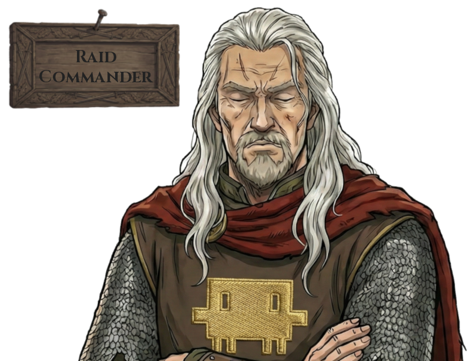

# Agent Guild Tavern

A reusable multi-agent workflow for autonomous software development. Agents
scout issues, plan sprints, implement fixes, audit test coverage, and deliver
pull requests — all coordinated through GitHub Issues and git worktrees.

## The Guild

*The following is lore.*

Guild agents serve the Guild — and an apprentice trails behind them.
Issues labeled `agent:ready` are autonomously implemented and delivered as pull requests.

### Agents (Skills)

<table>
<tr>
<td align="center" width="33%"></td>
<td align="center" width="33%"></td>
<td align="center" width="33%"></td>
</tr>
<tr>
<td align="center"><strong><code>issue-ranger</code></strong><br><sub><a href=".claude/skills/issue-ranger/SKILL.md">SKILL.md</a> | <a href=".claude/agents/issue-ranger.md">Agent</a></sub></td>
<td align="center"><strong><code>issue-slayer</code></strong><br><sub><a href=".claude/skills/issue-slayer/SKILL.md">SKILL.md</a> | <a href=".claude/agents/issue-slayer.md">Agent</a></sub></td>
<td align="center"><strong><code>issue-raid-commander</code></strong><br><sub><a href=".claude/skills/issue-raid-commander/SKILL.md">SKILL.md</a> | <a href=".claude/agents/issue-raid-commander.md">Agent</a></sub></td>
</tr>
<tr>
<td align="center" valign="top"><br><em>No Unknown Unknowns.</em><br><br>Ranges far. Crawls deep. Every wound in the codebase — named, scoped, filed. Nothing escapes the board.</td>
<td align="center" valign="top"><br><em>The Blade.</em><br><br>The <code>agent:ready</code> label is the contract. The worktree is where it dies. The PR is the proof. Does not theorize. Does not over-engineer. No issue survives.</td>
<td align="center" valign="top"><br><em>Forged by Sprints, Not Blade.</em><br><br>Reads the ready queue. Spots every conflict before it forms. Charts the sprint plan. Once fought on the front lines. Now stands behind them.</td>
</tr>
</table>

*`quality-finisher` (apprentice) — Audits post-slayer PRs for test coverage. Still learning the trade. [`SKILL.md`](.claude/skills/quality-finisher/SKILL.md)*

### Workflow

<table>
<tr>
<td align="center"><strong><code>dispatching-guild-expedition</code></strong><br><sub><a href=".claude/skills/dispatching-guild-expedition/SKILL.md">SKILL.md</a></sub></td>
</tr>
<tr>
<td align="center"></td>
</tr>
<tr>
<td align="center" valign="top"><br><em>One Command. Full Sprint.</em><br><br>Orchestrates the entire pipeline: Rangers × N scout in parallel, the user approves issues at the gate, Raid Commander maps the battlefield, then Slayers × N charge in parallel. From empty board to open PRs. The whole Guild, at once. Conquered.</td>
</tr>
</table>

## Installation

### Manual (git clone)

```bash
# Clone into your project
git clone https://github.com/ugai/agent-guild-tavern.git

# Copy skills and agents into your project
mkdir -p .claude/skills .claude/agents
cp -r ./agent-guild-tavern/.claude/skills/* .claude/skills/
cp -r ./agent-guild-tavern/.claude/agents/* .claude/agents/

# Copy the workflow guide
cp ./agent-guild-tavern/AGENTS.md AGENTS.md
```

Then add `@AGENTS.md` to your project's `CLAUDE.md` so agents pick up the
workflow rules.

### Project Setup

After installing, your project needs:

1. **GitHub labels**: `agent:ready`, `agent:proposed` — see [AGENTS.md](AGENTS.md)
2. **`AGENTS.md`** reference in `CLAUDE.md`: add `@AGENTS.md` to include workflow rules
3. **Project-specific rules** (optional): add a "Codebase Rules" section to
   your `AGENTS.md` with conflict-prone files, module conventions, etc.

## Usage

```
/issue-ranger                    # Scout for issues
/issue-raid-commander            # Analyze queue for conflicts
/issue-slayer                    # Pick up and implement an issue
/quality-finisher                # Audit PR test coverage
/verify-sprint                   # Batch-verify and merge PRs
/dispatching-guild-expedition    # Run the full pipeline
```

## Workflow

See [AGENTS.md](AGENTS.md) for the complete workflow documentation, including:

- Recommended workflow (Scout → Approve → Analyze → Implement → Review → Verify)
- Execution patterns (Standalone vs Team)
- Commit & PR conventions
- Label protocol
- Issue eligibility and priority rules

## License

[CC0 1.0 Universal](LICENSE) — public domain dedication.
