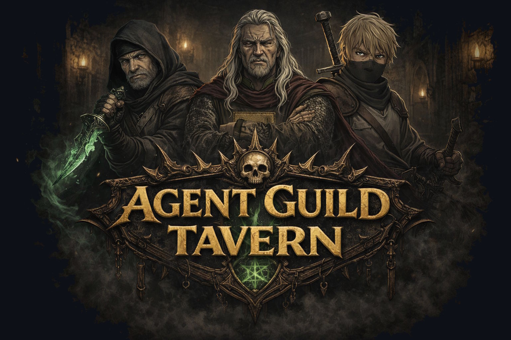

<p align="center">
  
</p>

# Agent Guild Tavern

A reusable multi-agent skills workflow for autonomous software development. Agents
scout issues, plan sprints, implement fixes, audit test coverage, and deliver
pull requests — all coordinated through GitHub Issues and git worktrees.

## The Guild

*The following is lore.*

Guild agents serve the Guild — and an apprentice trails behind them.
Issues labeled `agent:ready` are autonomously implemented and delivered as pull requests.

### Agents (Skills)

<table>
<tr>
<td align="center" width="33%"></td>
<td align="center" width="33%"></td>
<td align="center" width="33%"></td>
</tr>
<tr>
<td align="center"><strong><code>issue-ranger</code></strong><br><sub><a href="plugins/guild-tavern/skills/issue-ranger/SKILL.md">SKILL.md</a> | <a href="plugins/guild-tavern/agents/issue-ranger.md">Agent</a></sub></td>
<td align="center"><strong><code>issue-slayer</code></strong><br><sub><a href="plugins/guild-tavern/skills/issue-slayer/SKILL.md">SKILL.md</a> | <a href="plugins/guild-tavern/agents/issue-slayer.md">Agent</a></sub></td>
<td align="center"><strong><code>issue-raid-commander</code></strong><br><sub><a href="plugins/guild-tavern/skills/issue-raid-commander/SKILL.md">SKILL.md</a> | <a href="plugins/guild-tavern/agents/issue-raid-commander.md">Agent</a></sub></td>
</tr>
<tr>
<td align="center" valign="top"><br><em>No Unknown Unknowns.</em><br><br>Ranges far. Crawls deep. Every wound in the codebase — named, scoped, filed. Nothing escapes the board.</td>
<td align="center" valign="top"><br><em>The Blade.</em><br><br>The <code>agent:ready</code> label is the contract. The worktree is where it dies. The PR is the proof. Does not theorize. Does not over-engineer. No issue survives.</td>
<td align="center" valign="top"><br><em>Forged by Sprints, Not Blade.</em><br><br>Reads the ready queue. Spots every conflict before it forms. Charts the sprint plan. Once fought on the front lines. Now stands behind them.</td>
</tr>
</table>

*`quality-finisher` (apprentice) — Audits post-slayer PRs for test coverage. Still learning the trade. [`SKILL.md`](plugins/guild-tavern/skills/quality-finisher/SKILL.md)*

### Workflow

<table>
<tr>
<td align="center"><strong><code>dispatching-guild-expedition</code></strong><br><sub><a href="plugins/guild-tavern/skills/dispatching-guild-expedition/SKILL.md">SKILL.md</a></sub></td>
</tr>
<tr>
<td align="center"></td>
</tr>
<tr>
<td align="center" valign="top"><br><em>One Command. Full Sprint.</em><br><br>Orchestrates the entire pipeline: Rangers × N scout in parallel, the user approves issues at the gate, Raid Commander maps the battlefield, then Slayers × N charge in parallel. From empty board to open PRs. The whole Guild, at once. Conquered.</td>
</tr>
</table>

## Installation

### From GitHub (recommended)

Run these inside a Claude Code session:

```
/plugin marketplace add ugai/agent-guild-tavern
/plugin install guild-tavern@guild-tavern-marketplace
```

Skills are available as `/<skill-name>` after installation (e.g. `/issue-slayer`).

To receive updates automatically on startup, enable auto-update for the marketplace via `/plugin` → **Marketplaces** tab → **Enable auto-update**.

### Local development

```bash
# Load without installing (for plugin development)
claude --plugin-dir /path/to/agent-guild-tavern
```

### Manual (git clone)

```bash
# Clone into your project
git clone https://github.com/ugai/agent-guild-tavern.git

# Copy skills and agents into your project
mkdir -p .claude/skills .claude/agents
cp -r ./agent-guild-tavern/plugins/guild-tavern/skills/* .claude/skills/
cp -r ./agent-guild-tavern/plugins/guild-tavern/agents/* .claude/agents/
```

### Project Setup

After installing, your project needs:

1. **GitHub labels**: `agent:ready`, `agent:proposed` — see [reading-guild-rules](plugins/guild-tavern/skills/reading-guild-rules/SKILL.md)
2. **Project-specific rules** (optional): add conflict-prone files, module
   conventions, etc. to your project's `CLAUDE.md`

## Usage

Start here:

```
/reading-guild-rules
```

This prints the full workflow guide, skill descriptions, and label conventions. From there:

```
/issue-ranger                    # Scout for issues
/issue-raid-commander            # Analyze queue for conflicts
/issue-slayer                    # Pick up and implement an issue
/quality-finisher                # Audit PR test coverage
/verify-sprint                   # Batch-verify and merge PRs
/dispatching-guild-expedition    # Run the full pipeline
```

## Workflow

See [reading-guild-rules](plugins/guild-tavern/skills/reading-guild-rules/SKILL.md) for the
complete workflow documentation, including:

- Recommended workflow (Scout → Approve → Analyze → Implement → Review → Verify)
- Execution patterns (Standalone vs Team)
- Commit & PR conventions
- Label protocol
- Issue eligibility and priority rules

## The Tavern's Creed

The Guild Tavern was built for the lone adventurer — or a small party at most — who hires the Guild's agents to multiply their strength. A single commander dispatches Rangers to scout the land, Slayers to vanquish issues, and returns to the Tavern to reflect on the campaign.

This is not a war room for vast armies. When dozens of soldiers march on the same battlefield, no amount of tactical planning from a Raid Commander can prevent them from stepping on each other's boots. Such campaigns have a name now: *enterprise*. The Tavern was never built for that.

The Guild operates through the familiar language of Issues and Pull Requests — contracts pinned to the Tavern's quest board. The old ways still hold, where human judgment guides every critical turn. But a time may come when a Patron speaks directly to the Guild, and the agents carry out entire epics without pinning quests to the board.

Until that day, the Tavern stands as it is: a place where one vibe guides many hands, and the work of a week is done before sundown.

## License

[CC0 1.0 Universal](LICENSE) — public domain dedication.
